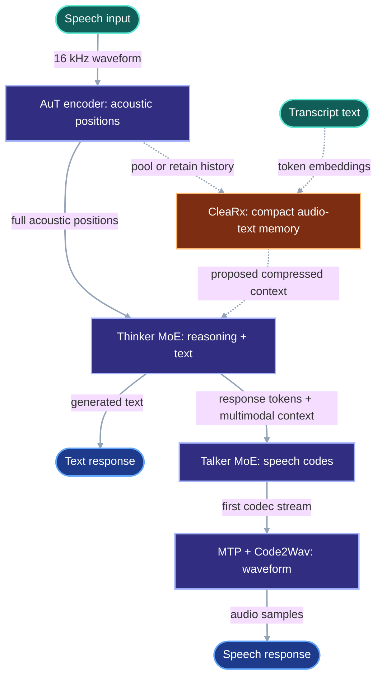

# Arjun: CleaRx in five minutes

CleaRx is testing whether Qwen3-Omni can compress earlier speech in a conversation while preserving acoustic evidence that a transcript misses.

## Qwen3-Omni

Qwen3-Omni is an open speech-language model that accepts text, audio, images, and video and can answer with text or streaming speech. Its Audio Transformer (AuT) turns speech into acoustic representations; the Thinker reasons over the input and generates text; the optional Talker, multi-token prediction module, and Code2Wav renderer turn the response into speech. CleaRx currently studies the path into the Thinker, with the Talker disabled. [Qwen technical report](https://arxiv.org/html/2509.17765v1#S2) · [official repository](https://github.com/QwenLM/Qwen3-Omni)

Solid lines are Qwen3-Omni’s normal path. Dashed lines mark the CleaRx research intervention.

## What we ran last night

The experiments form one diagnostic lineage. Each run asked the next question created by the previous result.

| Step | Experiment | Why we ran it | What it established |
|---:|---|---|---|
| 1 | [One-clip smoke](experiments/audio_memory_fusion_smoke/runs/a100/20260916T084009Z-a100/result.json) | Check that one transcript token plus pooled audio could replace the full acoustic span inside the frozen Thinker. | The path ran on an A100. Adding pooled audio reduced output distance from the full-audio run (KL) from 2.136 to 1.966 on one spoken digit; this was feasibility evidence only. |
| 2 | [Ten-clip coefficient sweep](experiments/audio_memory_fusion_sweep/runs/a100/20260916T084717Z-a100/result.json) | Test whether the one-clip direction survived more speakers and digits. | The pooled-audio weight (`alpha = 1`) improved 7 of 10 items over transcript-only and reduced mean KL by 7.0%. None of the compact conditions matched the teacher’s top token. |
| 3 | [Held-speaker emotion gate](experiments/audio_memory_fusion_gate/runs/ravdess_held_speaker/20260916T091635Z-a100/next-token-readout-failure.json) | Ask whether frozen representation features could choose the useful audio weight for unseen speakers. | The run stopped at its preflight: the next-token readout predicted one emotion for all six controls and got 1 of 6 correct. [VIPER confirmed the stop rule](experiments/audio_memory_gate_verification/runs/ravdess_held_speaker/01M2MTJYYX0ZY42WBV57D5AGDE/artifacts/verify_gate/report/verification.json). |
| 4 | [Transcript-trust study](experiments/audio_memory_transcript_trust/README.md) | Replace the invalid emotion readout with generated speech transcription, then vary whether the transcript was exact, incomplete, or conflicting. | The gate’s score and the grid oracle both ordered transcript quality correctly. Continuous weighting was 5.8% worse than the best fixed weight overall. The result supports a discrete keep/drop policy; memory savings remain untested. |

**Repository-derived example.** The transcript-trust run froze Qwen, generated exact answers for two ASR controls, evaluated 36 transcript/audio conditions, trained an eight-feature gate on speakers 01–04, and held speakers 05–06 out. The worker wrote the [A100 result](experiments/audio_memory_transcript_trust/runs/ravdess_transcript_corruption/20260916T101500Z-a100/result.json); VIPER then recomputed the fit locally and matched it within `8.88e-16` in the [verification record](experiments/audio_memory_transcript_trust_verification/runs/ravdess_transcript_corruption/01M2MYBFGD4XXNTBAHSJ2AH8QK/artifacts/verify_gate/report/verification.json).

The current [compression proposal](docs/proposals/audio_context_compression/audio_context_compression_pilot.pdf) asks where compression should happen. Last night’s results narrow the first defensible claim: transcript trust appears in frozen representations. A useful compactor must remove positions under an explicit memory budget.

## Turn this into a professor pitch

1. **State one question.** Can a discrete policy retain fewer AuT positions when the transcript is trustworthy, keep full acoustic evidence when it is weak, and match full-context Qwen at an equal memory budget?
2. **Run the missing experiment.** Compare full audio, transcript-only, fixed retention, and learned keep/drop retention on held-out speakers. Report retained positions or bytes beside output loss.
3. **Write a two-page proposal.** Use one architecture figure, one preliminary-results table, the hypothesis, baselines, held-out protocol, compute budget, and falsification criteria. Present the failed emotion readout and negative continuous-policy result as design evidence.
4. **Tailor the framing.** Lead with speech representation for a speech professor, long-context learning for an NLP professor, and latency or memory for a systems professor.
5. **Ask for a bounded next step.** Send the two pages and repository, request a 20-minute methods critique, and propose one small independent-study milestone.

## Columbia shortlist

The Fall 2026 research-fair listings show current interests; each professor’s availability requires confirmation. The best first contact depends on the proposal’s final center of gravity. [Research Fair, last updated September 10, 2026](https://www.cs.columbia.edu/research-fair-fall-2026/)

| Candidate | Alignment | Pitch angle |
|---|---|---|
| [Julia Hirschberg](https://www.cs.columbia.edu/~julia/research_summary.htm) | The fair lists projects on speech-encoder representations, prosody, and multilingual speech; her group also studies acoustic cues to trust and emotion. | Lead with what compressed AuT states preserve about words, prosody, and transcript reliability. |
| [Kathleen McKeown](https://www.cs.columbia.edu/~kathy/) | Her fair projects include long-context processors and multimodal, interactive NLP. | Lead with adaptive memory for long spoken conversations and a controlled evaluation of effective context. |
| [Gil Zussman](https://datascience.columbia.edu/content/gil-zussman) | His fair project targets real-time LLM inference on constrained edge systems using adaptive compression and names KV caching as relevant background. | Lead with an equal-quality memory/latency frontier and eventual edge deployment. |
| [Zishen Wan](https://www.cs.columbia.edu/2026/zishen-wan-brings-ai-native-computing-research-to-columbia/) | His fair listing covers LLM/VLM systems optimization, GPUs, edge devices, and accelerators. | Lead with cross-layer profiling and systems support for speech-model memory policies. |
| [Richard Zemel](https://www.cs.columbia.edu/~zemel/) | His group studies multimodal learning, controllability, uncertainty, and memory models; the fair lists hypermodal representation learning. | Lead with a calibrated gate that changes acoustic retention under transcript uncertainty. |

Recommended contact order: Hirschberg first for the scientific question, then McKeown. Approach Zussman or Wan if the proposal becomes a systems paper, and Zemel if the learned gate becomes the main contribution.

## Sources

- Qwen Team. [*Qwen3-Omni Technical Report*](https://arxiv.org/html/2509.17765v1), §§2.1–2.5, 2025.
- Qwen Team. [Qwen3-Omni official repository](https://github.com/QwenLM/Qwen3-Omni), model overview and usage documentation.
- Columbia Computer Science. [Fall 2026 Research Fair](https://www.cs.columbia.edu/research-fair-fall-2026/), updated September 10, 2026.
- Columbia profiles: [Hirschberg](https://www.cs.columbia.edu/~julia/research_summary.htm), [McKeown](https://www.cs.columbia.edu/~kathy/), [Zussman](https://datascience.columbia.edu/content/gil-zussman), [Wan](https://www.cs.columbia.edu/2026/zishen-wan-brings-ai-native-computing-research-to-columbia/), and [Zemel](https://www.cs.columbia.edu/~zemel/).
- CleaRx. [Transcript-trust interpretation](experiments/audio_memory_transcript_trust/README.md) and linked immutable run records, commit `673b2be`.
