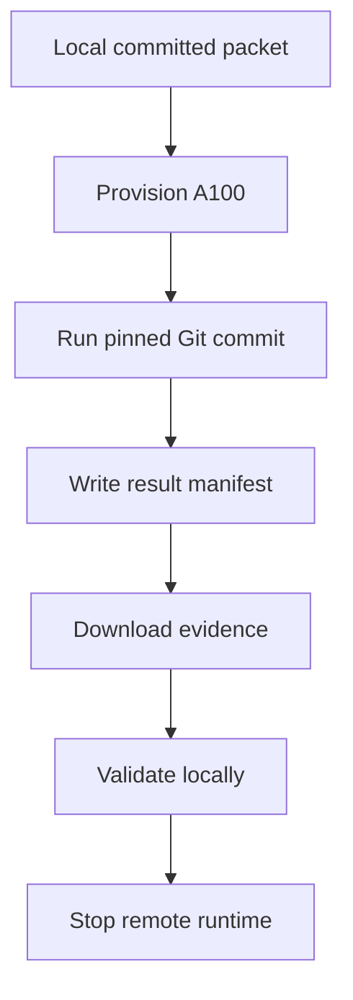

# Turnkey agentic execution proposal

## Native Qwen3-Omni waveform runtime and bounded audio context on one 24 GB NVIDIA L4

| Document field | Value |
|---|---|
| Document type | Agentic project handoff and execution specification |
| Intended recipient | Primary local Codex orchestration agent |
| Human owner | Repository owner/project lead |
| Status | Audited; owner approval required before local bootstrap |
| Canonical deployment target | One NVIDIA L4, 24 GB VRAM |
| Local control environment | ChatGPT desktop local project on an 8-core, 8 GB Apple M1 |
| Reference/training environment | A100 provisioned through Google Colab CLI |
| Immediate authorized scope | Bootstrap orchestration package only |

### Handoff declaration

This document is the complete operational handoff from the originating cloud planning thread to the local project. It preserves the frozen technical architecture, experimental program, orchestration design, environment boundaries, acceptance gates, and immediate assignment in a form suitable for direct ingestion by a local coding agent.

The receiving agent shall act as the primary local orchestrator. It must work from the local Git repository opened in the ChatGPT desktop app. The checked-in repository—not the originating chat, not this document once superseded by later checked-in decisions, and not any agent's recollection—is the canonical project state.

This is both a structured proposal and an executable management specification. Its purpose is to let the receiving agent create a safe orchestration system without needing follow-up reconstruction of the prior conversation.

### How to use this document

1. Keep this document beside the [TeX proposal](proposal.tex) and [rendered PDF](proposal.pdf) in the local repository.
2. Open the repository as a Local project in the ChatGPT desktop app.
3. Start a new local Codex chat titled `Orchestrator`.
4. Instruct that agent to read this document completely and execute the section titled **Immediate authorized assignment: BOOTSTRAP-001**.
5. Treat checked-in files and validated result manifests as canonical after bootstrap.
6. Do not dispatch production implementation workers until the bootstrap review gate passes.

## Executive directive

The receiving agent is the primary local Codex orchestration agent for this systems-research project.

The immediate job is to turn this architectural proposal into a validated, machine-readable execution system that multiple coding agents can safely execute. The receiving agent is authorized to create the orchestration scaffold, schemas, validators, Phase 0 work packets, test fixtures for the orchestration layer, remote-runner wrappers, and documentation described below. It must not begin production model porting in the bootstrap step. At the end of Bootstrap-001, it must validate everything, report what was created, show the initial DAG, identify unresolved choices, and stop for review before dispatching Phase 0 workers.

The agent must read this document completely before editing. It must then inspect the repository, its `AGENTS.md` files, Git state, proposal, and existing code. It must preserve all unrelated user work. If the intended project directory is not yet a Git repository and is nonempty or ambiguous, it must ask before initializing it. If it is clearly the empty/new directory selected for this project, initialization is permitted. Existing artifacts must not be overwritten merely to conform to the target tree.

### Mission

Build and evaluate a native waveform-in to waveform-out implementation of `Qwen3-Omni-30B-A3B-Instruct` in C++ using GGML/GGUF and `llama.cpp`, deployable under a hard single-card NVIDIA L4 24 GB memory ceiling.

The project has two major technical programs:

1. Port the complete native Qwen3-Omni speech-output system—Talker, MTP, Code2Wav, and Thinker–Talker scheduling—into a C++/GGML/GGUF runtime, then make it fit and run in real time on one L4.
2. Implement bounded conversational context in native C++, beginning with recent-window and VoxZip-derived baselines and progressing to an ASR-free learned AuT compactor. The serving process's live neural state, queues, runtime ledgers, and retained audio buffers must remain bounded independently of interaction length. Append-only audit evidence may grow on disk, but the serving process must release each serialized record and its source buffers after the bounded live consumers finish.

The project is task-agnostic. Do not encode a pharmacy-specific ontology, prompt, scoring rule, or evaluation assumption into the architecture.

### Non-negotiable invariants

- Final deployed inference is one native C++ process.
- The final agent is waveform-in to waveform-out through Qwen3-Omni's own modality stack.
- No Python serving process is part of deployed inference.
- No external TTS system is part of deployed inference.
- The intended final context method is ASR-free. Whisper is allowed only as a research/reference implementation of VoxZip and as an ablation.
- Deployment hardware is exactly one NVIDIA L4 with 24 GB VRAM. Do not propose replacing it with larger hardware.
- The Thinker remains Q4_K_M.
- The Talker remains Q8_0. CPU-backed residency changes placement, not numerical precision.
- The AuT input stack is Q8_0, preserving sensitive tensors at BF16 when required for fidelity.
- MTP is BF16.
- Code2Wav is BF16 and executes on CPU in the target configuration.
- Thinker and Talker KV are Q8_0.
- Vision tensors and vision-only runtime paths are removed from the deployment package.
- Routed experts are never permanently pruned, approximated, or replaced. A cache miss may add latency but must not change the authoritative Q8 expert.
- The static runtime must fit before conversational compression is credited with making startup possible.
- Correctness precedes optimization; optimization precedes policy comparison.

### Frozen target architecture

The steady-state deployment configuration is:

| Component | Precision | Primary placement | Lifetime/residency policy |
|---|---|---|---|
| Thinker | Q4_K_M | L4 | Resident throughout session |
| AuT and audio projector | Q8_0, sensitive tensors BF16 | L4 shared modality arena | Resident while listening; absent while speaking |
| Vision encoder/projector | Absent | — | Removed from GGUF and runtime |
| Talker dense tensors, routers, norms, embeddings, heads | Q8_0/BF16 as specified | L4 | Resident during speaking |
| Talker routed experts | Q8_0 authoritative copy | Pinned CPU RAM plus GPU slot cache | Exact, demand-loaded, asynchronously prefetched |
| MTP | BF16 | L4 | Resident during speaking; bounded current-frame state |
| Code2Wav | BF16 | CPU | Causal streaming, bounded left context |
| Thinker KV | Q8_0 | L4 | Fixed total conversational budget |
| Talker KV | Q8_0 | L4 | Independently bounded/reset according to Talker state |
| Scratch/workspace | Native selected dtypes | Shared CPU/GPU arenas | Lifetime-managed and reused across phases |
| PCM playback | Float/native audio buffers | CPU | Initial 320 ms adaptive jitter buffer |

The L4 peak target is below 22 GiB under worst-case tested phases, leaving operational reserve beneath the hard 24 GB ceiling. File sizes, decimal GB, binary GiB, runtime allocation, and CUDA peak memory must be reported separately.

The modules use distinct coordinate systems. Preserve separate typed domains for:

- input PCM samples and wall-clock time;
- AuT frames;
- Thinker positions;
- Talker positions;
- codec frames;
- the 16 codec quantizer values within each frame;
- output PCM samples.

Do not silently convert one coordinate domain to another. Any mapping across modules must be explicit, typed, versioned, and tested.

### Correct Qwen3-Omni output structure

The port must follow the released model rather than a generic multi-head audio sketch:

- The Thinker performs multimodal reasoning.
- The Talker is a separate 20-layer MoE generation model with its own prompt processing and KV state.
- Talker predicts the primary codec code for a frame.
- MTP autoregressively predicts the other 15 residual codebooks, each conditioned on preceding codes in that same frame.
- The complete frame therefore contains 16 hierarchical codebook values; they are not 16 independent simultaneous projections.
- Code2Wav is a complete causal codec decoder, not a single transposed convolution. It emits incremental 24 kHz waveform audio and maintains a bounded causal left context. The released configuration indicates a 72-frame sliding window.
- Thinker–Talker scheduling is asynchronous and must explicitly transfer the model-native conditioning representations required by the Talker.

The reference implementation and official configuration are the authority when this document and code disagree.

## Canonical repository architecture

Converge on this shape without deleting or needlessly relocating useful existing files:

```text
Local Git repository
├── AGENTS.md
├── upstream.lock
├── docs/
│   ├── proposal.tex
│   ├── proposal.pdf
│   ├── decisions.md
│   └── architecture/
│       ├── abi_v0.md
│       ├── runtime_gap_matrix.md
│       ├── memory_model.md
│       └── execution_environments.md
├── orchestration/
│   ├── plan.yaml
│   ├── schemas/
│   │   ├── plan.schema.json
│   │   ├── work_packet.schema.json
│   │   ├── result.schema.json
│   │   ├── fixture.schema.json
│   │   ├── benchmark.schema.json
│   │   └── state.schema.json
│   ├── work_packets/
│   │   ├── BOOTSTRAP-001.yaml
│   │   ├── P0-001.yaml
│   │   ├── P0-002.yaml
│   │   └── ...
│   └── state.json
├── tests/
│   ├── orchestration/
│   └── fixtures/
│       ├── reference/
│       ├── native/
│       └── manifests/
├── scripts/
│   ├── validate_plan.py
│   ├── validate_result.py
│   ├── validate_fixtures.py
│   ├── run_packet.py
│   └── remote/
│       ├── a100_run.sh
│       ├── a100_fetch.sh
│       └── verify_remote_environment.sh
├── tools/
│   ├── reference/
│   ├── inventory/
│   └── benchmarks/
└── runs/
    └── <work-packet-id>/
        └── <run-id>/
            ├── result.json
            ├── environment.json
            ├── stdout.log
            ├── stderr.log
            └── artifacts/
```

The proposal explains the system. The orchestration graph determines what may execute. Prose status is not execution state.

## Machine-readable orchestration model

Represent each bounded unit of work as a YAML work packet. Dependencies define a directed acyclic graph:

$$
G=(V,E),\qquad
(P_i,P_j)\in E
\iff
P_j\text{ requires a validated output from }P_i.
$$

`plan.yaml` is the graph index and declares phase gates. Each packet is an immutable detailed contract. `state.json` is the sole mutable authority for packet lifecycle status and is written only by the orchestrator or its state-management script, never directly by worker agents. A packet file must change only through a new content digest; results produced against an earlier digest do not satisfy the revised packet.

Bootstrap must create JSON schemas for `plan.yaml` and `state.json` in addition to the packet, result, fixture, and benchmark schemas. Every schema-governed document declares `schema_version`. Each `plan.yaml` node binds a packet ID to its repository-relative path and SHA-256 content digest. Each `state.json` entry and result manifest repeats that packet digest. The result validator reconstructs the packet at the recorded Git commit, recalculates its digest, and rejects a mismatch before evaluating commands or artifacts.

The lifecycle states and permitted transitions are:

```text
planned -> blocked | ready
blocked -> ready | cancelled
ready -> running | blocked | cancelled
running -> validating | failed | cancelled
validating -> complete | failed
failed -> ready | cancelled
complete -> terminal
cancelled -> terminal
```

Every transition records the packet digest, prior state, next state, timestamp, actor, and reason. A revised packet receives a new digest and begins a new lifecycle entry; the orchestrator does not reopen a `complete` or `cancelled` entry in place.

At minimum, every packet must define:

- stable ID and title;
- phase;
- objective and rationale;
- dependencies;
- execution environment;
- immutable inputs and their expected versions/hashes;
- exclusive write scope/owned files;
- forbidden paths and forbidden architectural changes;
- required outputs;
- acceptance commands;
- required checks;
- numerical tolerances where relevant;
- required performance measurements where relevant;
- evidence/result format;
- non-goals;
- escalation conditions;
- schema version and evidence/result contract.

Start from this concrete example and enrich it without making the format ornamental:

```yaml
schema_version: "1.0.0"
id: P0-003B
title: Generate reference module fixtures
phase: 0

objective: >-
  Generate deterministic reference fixtures at the frozen native module
  boundaries using the pinned upstream implementation.

depends_on:
  - P0-001
  - P0-002
  - P0-003A

execution:
  environment: a100
  write_scope:
    - tests/fixtures/reference/
    - tools/reference/
    - runs/P0-003B/

inputs:
  - path: upstream.lock
    sha256: 0123456789abcdef0123456789abcdef0123456789abcdef0123456789abcdef
  - path: orchestration/schemas/fixture.schema.json
    sha256: fedcba9876543210fedcba9876543210fedcba9876543210fedcba9876543210

outputs:
  - tests/fixtures/reference/manifest.json

acceptance:
  commands:
    - python scripts/validate_fixtures.py
  required_checks:
    - checksums_present
    - tensor_shapes_present
    - deterministic_seed_recorded

forbidden:
  - changing_native_abi
  - editing_ggml_runtime

non_goals:
  - optimizing_reference_inference
  - changing_sampling_semantics

escalation:
  - reference_output_is_nondeterministic_under_fixed_seed
  - required_model_artifact_is_unavailable

evidence:
  result_schema: orchestration/schemas/result.schema.json
  result_path_template: runs/P0-003B/{run_id}/result.json
```

A packet $P$ with result manifest $R$ is complete if and only if:

$$
\text{Complete}(P,R)=
\text{DependenciesComplete}(P)
\land
\text{ResultBindsPacket}(P,R)
\land
\text{ArtifactsPresent}(P,R)
\land
\text{AcceptancePasses}(P,R)
\land
\text{EvidenceValid}(P,R).
$$

`ResultBindsPacket(P,R)` means that `R` names the same packet ID, packet SHA-256 digest, schema version, and Git commit that the verifier reconstructs for `P`. `ArtifactsPresent(P,R)` requires the exact declared output set; extra or missing artifacts fail validation. An agent's prose claim that something works is not evidence. A result manifest must name the exact commit, packet digest, environment, commands, outcomes, artifact checksums, and deviations.

### Status and authority rules

- Only the orchestrator changes lifecycle status in `orchestration/state.json`; packet files contain no mutable current-status field.
- Workers may write only within their declared `write_scope`.
- Shared interface changes require an explicit interface-change packet or orchestrator approval.
- A worker that discovers a missing dependency reports a blocker; it does not broaden its own scope.
- Phase gates depend on validated outputs, never merely on all child agents returning.
- Every packet runs from a clean, identified commit.
- Result validation must reject unknown schema versions, packet-digest mismatches, missing hashes, missing commands, or artifacts outside the declared output set.
- The plan validator must reject cycles, missing dependencies, duplicate IDs, invalid phase transitions, overlapping concurrent write scopes, packet-path or digest mismatches, and nonexistent schema references.

## Root `AGENTS.md` operating rules

Create a concise but strict root `AGENTS.md` that every desktop chat and worktree inherits. It should express at least these rules:

1. Read the assigned work packet, root `AGENTS.md`, and any nearer-scoped `AGENTS.md` before working.
2. Inspect `git status` before editing and preserve unrelated user changes.
3. Edit only packet-owned paths. Do not change shared interfaces without declared authorization.
4. Use the pinned versions in `upstream.lock` and record every unavoidable deviation.
5. Produce all required artifacts and a schema-valid result manifest.
6. Run the packet's acceptance commands; do not infer success from compilation or prose.
7. Report blockers instead of silently expanding scope or weakening acceptance criteria.
8. Never initiate an A100 job without a work-packet ID and clean Git commit.
9. Never declare performance from an uninstrumented or thermally/transiently unrepresentative run.
10. Correctness gates precede performance optimization.
11. Preserve task-agnostic architecture and the frozen precision policy unless a dedicated decision packet changes it.
12. Do not commit credentials, model access tokens, Colab session data, or large generated model files.

Add narrower `AGENTS.md` files only where genuinely different rules are required, such as generated fixtures or remote-run artifacts. Avoid conflicting instructions.

## Local ChatGPT desktop organization

Use one local ChatGPT project connected to the Git repository. Checked-in artifacts are canonical. Git worktrees isolate write-heavy workers.

| Role | Desktop representation | Authority |
|---|---|---|
| Orchestrator | One pinned Local chat in the main checkout | Owns DAG, status, interfaces, phase gates, packet dispatch, integration order, and state updates |
| Worker A | Dedicated Codex chat in worktree A | Owns one ready packet and only its declared files |
| Worker B | Dedicated Codex chat in worktree B | Owns a second non-overlapping ready packet |
| Worker C | Dedicated Codex chat in worktree C | Owns a third non-overlapping ready packet |
| Verifier | Fresh read-oriented chat/check-out | Reviews evidence, reruns acceptance tests, challenges unsupported claims, and does not inherit the implementer's assumptions |

Use subagents within a single chat for bounded read-heavy work such as source exploration, documentation review, fixture comparison, or failure analysis. Use separate worktrees for concurrent code-writing work. Do not allow two workers to own overlapping files. Do not run several heavy local builds simultaneously on the 8 GB M1; the orchestrator must serialize memory-intensive compilers, Metal tests, or model executions.

The reasoning work of multiple hosted agents is not itself constrained by local RAM. The local commands those agents launch are constrained by the Mac.

### Recommended worktree workflow

Codex-managed worktrees start from the selected branch commit in detached-HEAD state by default. A worker may use **Create branch here** after producing a coherent change or hand the chat back to Local for integration. A manually created permanent worktree may instead begin on a named packet branch. The result manifest records the actual commit and packet digest in either workflow.

For each ready, non-overlapping packet:

1. The orchestrator creates a manual named-branch worktree or opens a Codex-managed worktree from the validated integration commit, recording which mode the packet uses.
2. The worker chat is opened against that worktree and receives only the packet, relevant interfaces, and canonical docs—not an undifferentiated request to implement the entire proposal.
3. The worker performs its acceptance tests and writes `runs/<packet>/<run-id>/result.json` or a local pre-result according to policy.
4. The verifier checks the diff, reruns acceptance, and validates the result manifest.
5. The orchestrator merges in dependency order, resolves only integration-level conflicts, and updates state.
6. The worktree is removed only after its commit is integrated and evidence retained.

Do not ask workers to update `state.json` or merge their own branches.

## Migrating from the cloud planning thread

Do not treat an old conversation as operational state. There is no need to reproduce the conversation locally once these files are present.

The migration procedure is:

1. Create or clone the intended repository on the Mac.
2. Put the current [TeX proposal](proposal.tex), [compiled PDF](proposal.pdf), and this handoff document under version control in `docs/`, preserving any narrower repository convention that already owns these artifacts.
3. Create `docs/decisions.md` containing the frozen decisions in this document, each with an ID, date, rationale, consequences, and supersession status.
4. Open the repository folder as a Local project in the ChatGPT desktop app.
5. Start a new Local Codex chat titled `Orchestrator`.
6. Give that chat this entire prompt and explicitly state: “Checked-in files are canonical. Complete Bootstrap-001 only, validate it, and stop for review.”
7. After bootstrap, use worktree chats for Phase 0 packets.

The local repository remains authoritative even when A100 runs execute remotely. Results return as versioned artifacts; they do not live only in notebook output or chat prose.

Relevant OpenAI guidance:

- Local projects: <https://learn.chatgpt.com/docs/projects>
- Git worktrees: <https://learn.chatgpt.com/docs/environments/git-worktrees>
- Repository `AGENTS.md`: <https://learn.chatgpt.com/docs/agent-configuration/agents-md>

If the desktop product behavior differs from these documents, inspect current official guidance rather than inventing a workflow.

## Execution environments and the 8 GB M1 boundary

The local M1 is the control plane and a useful correctness platform, but it is not a miniature L4.

Define three explicit test tiers:

### `test-local`

Runs on the M1 and must be cheap enough for ordinary iteration:

- schema and DAG validation;
- C++ compilation where feasible;
- loader/parser unit tests using metadata-only or small synthetic GGUF fixtures;
- module interface tests using stored tensors;
- Code2Wav CPU fixture tests with short sequences;
- MTP tests with truncated dimensions or fixed hidden-state fixtures;
- scheduler state-machine tests with mocked modules;
- allocator lifetime tests with synthetic allocations;
- fixed-rate AuT pooling tests;
- context-budget and retention-policy simulations;
- result-manifest and remote-runner tests;
- structurally isomorphic tiny-model fixtures where full weight residency is unnecessary.

Phase 0 can be completed mostly locally except hardware measurements. Much of Phase 1 can be developed locally from fixed boundary fixtures. AuT and the smaller output modules may be testable in reduced form. A full Q8 Talker load is likely too large for an 8 GB machine, so use layer-level fixtures, selected experts, metadata-only loads, or a miniature shape-compatible model for control-flow tests.

### `test-reference`

Runs on the A100 through Colab:

- pinned PyTorch reference generation;
- full module boundary fixtures;
- all-resident Q8 Talker fidelity oracle when feasible;
- full Thinker–Talker–MTP–Code2Wav numerical comparisons;
- F16 Whisper-Turbo VoxZip reproduction;
- teacher/student compactor training and distillation;
- larger correctness and quality evaluation.

### `test-l4`

Runs on an actual NVIDIA L4 and is mandatory for deployment claims:

- peak and phase-specific VRAM;
- shared-arena behavior;
- CPU-backed Talker expert residency;
- PCIe stalls, prefetch, and cache-hit curves;
- p50/p95/p99 real-time factor;
- endpoint-to-first-audio latency;
- jitter-buffer underflow;
- long-running stability and OOM reserve;
- Q8/Q5 Whisper deployment adaptations where evaluated.

An A100 cannot establish L4 memory fit, PCIe behavior, or latency. The absence of current L4 access is an explicit infrastructure blocker for `test-l4`, not permission to substitute A100 numbers.

Generating fewer output tokens does not solve static weight residency. The Q4 Thinker artifact alone is approximately 18.6 GB, so a truncated conversation cannot make the full model load on an 8 GB Mac. Use fixtures and miniature graphs locally rather than pretending a short generation is equivalent.

## A100 execution through Google Colab CLI

Treat Colab as an ephemeral remote executor, not as the source repository. Google announced an official Colab CLI supporting local submission, accelerator requests, logs, and artifact downloads. Before writing wrappers, inspect the installed CLI with `colab --help` and subcommand help; do not hard-code syntax from memory when the installed version is authoritative.

Reference: <https://developers.googleblog.com/introducing-the-google-colab-cli/>

The control loop is:



Equivalent text:

```text
Local committed packet
  -> provision A100
  -> execute a pinned clean Git commit
  -> produce result manifest and artifacts
  -> download logs/evidence
  -> validate locally
  -> stop/discard the remote runtime
```

Every remote invocation must record:

- work-packet ID;
- run ID;
- exact Git commit and branch;
- rejection of a dirty local tree;
- upstream, model, tokenizer, GGUF, and fixture hashes;
- accelerator model and memory;
- operating system, driver, CUDA, compiler, Python reference environment, GGML build flags, and relevant library versions;
- exact command and environment variables that affect results, with secrets redacted;
- random seeds and sampling settings;
- start/end times and wall time;
- exit status;
- stdout/stderr logs;
- output artifact paths, sizes, and checksums;
- measured memory and timing data;
- infrastructure interruptions or deviations.

Do not upload an arbitrary dirty working directory. Commit the worker branch, make the remote job fetch or receive that exact commit, and reject commit mismatches before compute begins.

Store returned evidence under:

```text
runs/<packet-id>/<run-id>/
```

The runner wrapper must:

1. validate the packet and current commit;
2. verify that no secret is included in logs or manifests;
3. provision/request the A100;
4. establish or upload the exact source state;
5. verify the remote commit and environment;
6. execute the packet's declared commands;
7. write a schema-valid `result.json` even on controlled failure;
8. download evidence atomically into the run directory;
9. validate checksums locally;
10. stop the runtime when possible.

Colab availability, preemption, and quota failures are infrastructure outcomes, not numerical failures. Design jobs to be resumable. Cache large immutable model files in permitted persistent storage, but always verify their hashes. Never commit tokens, credentials, or service configuration.

## Full phased implementation plan

The following is the canonical high-level program. Bootstrap converts it into packets. Do not assign an entire phase to one undifferentiated agent.

### Bootstrap-001 — Create the orchestration package

This is the only implementation task authorized immediately.

Required outputs:

- root `AGENTS.md`;
- `docs/decisions.md` with frozen architectural decisions;
- `docs/architecture/execution_environments.md`;
- `orchestration/plan.yaml` containing Bootstrap and Phase 0 nodes plus later phase placeholders/gates;
- JSON schemas for plans, work packets, results, fixtures, benchmarks, and orchestration state;
- concrete Phase 0 packet YAML files;
- `orchestration/state.json` initialized through a documented mechanism;
- DAG/plan validator;
- result validator;
- fixture-manifest validator skeleton;
- local orchestration tests;
- Colab A100 run/fetch wrapper skeletons that safely inspect current CLI syntax;
- integration, branch, worktree, and evidence policy;
- one command that validates the complete bootstrap package locally.

Bootstrap acceptance must prove:

- all JSON schemas are valid;
- all packet YAML files validate;
- `plan.yaml` and `state.json` validate against their schemas;
- every plan/state/result packet digest matches the packet bytes at the recorded commit;
- the DAG is acyclic;
- every dependency exists;
- phase gates are coherent;
- lifecycle statuses and recorded transitions follow the allowed state machine;
- concurrent-ready packets have disjoint write scopes;
- required paths are inside the repository;
- sample valid and invalid result manifests behave as expected;
- remote wrappers reject a dirty tree and missing packet/commit data without provisioning anything;
- no production runtime files are edited.

At completion, stop and report:

- file tree created;
- validation commands and results;
- rendered Phase 0 DAG;
- ready/blocked packet list;
- unresolved decisions;
- the proposed first parallel wave.

Do not dispatch the wave until reviewed.

### Phase 0 — Evidence and contract formation

The goal is to replace assumptions with pinned source evidence, frozen interfaces, and reproducible fixtures before parallel porting.

#### P0-001: Upstream/runtime audit and version lock

- Pin exact commits/releases for `llama.cpp`, `whisper.cpp`, Qwen3-Omni reference code, model repositories, tokenizer/config, conversion scripts, CUDA, and compilers.
- Audit current native Qwen3-Omni audio-input support and current missing output subsystems.
- Locate existing GGML operators relevant to Talker, MTP, and Code2Wav.
- Inventory public/native APIs for model loading, tensor placement, Q8 KV, device scheduling, backend copies, and instrumentation.
- Produce `upstream.lock` and `docs/architecture/runtime_gap_matrix.md`.
- Cite source files, commit hashes, and line-stable symbols where possible.

#### P0-002: Model and tensor inventory

- Inventory every Thinker, AuT, vision, Talker, MTP, Code2Wav, speaker, projection, normalization, router, expert, embedding, and output-head tensor.
- Record source name, target GGUF name, module, shape, stride/layout, source dtype, target dtype, quantization, checksum, and intended backend.
- Identify which tensors are audio-only, vision-only, shared, sensitive, routed, permanent, cacheable, or CPU-bound.
- Confirm released layer counts, expert counts/activation, 16-codebook hierarchy, codec vocabulary, and Code2Wav window from official configuration.
- Produce `tensor_manifest.json` plus human-readable analysis.

#### P0-003A: Reference fixture contract and harness design

- Define the versioned fixture schema, boundary-coverage matrix, generator interface, manifest rules, and local validation harness without generating model-derived fixtures.
- Cover AuT, Thinker conditioning, Talker layers/router/expert calls, Talker primary codec output, every MTP residual step, Code2Wav chunks, and cross-module handoffs.
- Define shapes, dtypes, seeds, sampling configuration, tolerances, checksums, and provenance fields.
- Define adversarial cases for empty/background intervals, variable chunks, final partial audio chunks, turn end, long turns, interruption/cancellation, repeated phase transitions, and context reconstruction.

#### P0-003B: Reference fixture generation

- Depend on validated outputs from P0-001, P0-002, and P0-003A.
- Generate deterministic fixtures from the pinned PyTorch implementation and bind each fixture manifest to the upstream lock, tensor manifest, generator commit, and fixture-schema digest.
- Keep fixtures small enough for local validation where possible; use representative full fixtures where small substitutes cannot establish correctness.

#### P0-004: Native ABI and ownership contract

- Define typed C++ interfaces for PCM input, AuT output, Thinker conditioning, Talker requests/results, expert loads, MTP frames, codec frames, Code2Wav chunks, scheduler events, and bounded-context rebuilds.
- Specify ownership, lifetime, device, alignment, stream, synchronization event, mutability, error semantics, and cancellation behavior for every buffer crossing a module boundary.
- Version the GGUF metadata and native module ABI.
- Define loader diagnostics and incompatibility rejection.
- Produce `docs/architecture/abi_v0.md` only after other Phase 0 evidence is reconciled.

#### P0-005A: L4 measurement contract and host profile

- Define the L4 measurement schema, phase live-set model, instrumentation interface, and required host profile before inserting estimated tensor sizes.
- Record the certified host CPU, RAM, pinned-memory limit, PCIe topology/link state, storage, operating system, driver, CUDA version, power mode, and thermal controls. Results from another host remain exploratory until the deployment profile accepts that configuration.
- Define phase-specific measurements for listening, concurrent VoxZip listening, sequential VoxZip endpointing, Thinker prefill, Talker startup, sustained output, barge-in, and context rebuild.

#### P0-005B: Manifest-derived L4 memory budget

- Depend on validated outputs from P0-002 and P0-005A.
- Construct an auditable budget from actual tensor-manifest data rather than broad parameter-count estimates.
- Separate weights, KV, workspaces, staging, CUDA/runtime overhead, fragmentation, and safety reserve for every live phase set.
- Produce `l4_memory_budget.json` with expected, range, and measured fields plus explicit decimal-GB and binary-GiB units.

#### P0-006A: Expert-cache and allocator benchmark design

- Define microbenchmark inputs, router-trace format, allocator simulation, measurements, and result schema without claiming representative transfer or hit-rate results.
- Cover pinned-host transfers, per-layer slot lookup, asynchronous DMA, staging buffers, compute overlap, cache policy traces, and shared-arena lifetime events.

#### P0-006B: Manifest-derived risk spikes

- Depend on validated outputs from P0-002, P0-005B, and P0-006A.
- Build the synthetic/native microbenchmarks with representative expert shapes from the tensor manifest.
- Estimate the feasibility of a 1.5 GiB GPU expert-slot pool without claiming end-to-end results.
- Run the shared-arena lifetime simulation for AuT, optional Whisper, and Talker expert slots.
- Produce `expert_cache_spike.json` and allocator evidence.

#### P0-007A: Evaluation contract design

- Freeze the versioned corpus manifest, task strata, prompts, audio, sampling settings, output limits, seeds, and paired comparison keys.
- Define correctness tolerances, semantic and acoustic metrics, paired equivalence or non-inferiority margins, minimum material-improvement thresholds, latency/RTF/underflow limits, warm-up and repetition rules, confidence intervals, and failure attribution fields.
- Produce the draft `docs/evaluation_contract.md`, `evaluation_corpus_manifest.json`, and benchmark-threshold document governed by `benchmark.schema.json`.

#### P0-007B: Deployment acceptance binding

- Depend on validated outputs from P0-005A and P0-007A.
- Bind the evaluation workload and deployment thresholds to the certified host profile and define which alternate hosts may support exploratory runs only.
- Validate that every later gate resolves to a named metric, paired comparison, margin, corpus slice, workload, and host constraint.
- Publish the frozen evaluation contract and benchmark thresholds consumed by later packets.

#### Phase 0 gate

P0-004 depends on validated outputs from P0-001, P0-002, P0-003B, P0-005B, P0-006B, and P0-007B. Freeze `abi_v0` only after the upstream lock, tensor manifest, generated fixtures, memory model, risk spikes, and evaluation contract are integrated and consistent. Production porting cannot begin before this gate passes.

The first parallel wave after bootstrap should contain only:

- upstream/runtime audit;
- model/tensor inventory;
- reference-fixture contract and harness design;
- L4 measurement-contract and host-profile design;
- expert-cache and allocator benchmark design;
- evaluation-contract design.

Fixture generation, manifest-derived memory budgeting, deployment-acceptance binding, and representative risk spikes form the second wave after their declared inputs validate. The ABI packet runs only after those outputs and the frozen evaluation contract validate.

### Phase 1 — Unoptimized native module correctness

The goal is correct native execution with fixed fixtures, not L4 fit or real-time performance.

Parallel workstreams after `abi_v0`:

#### 1. GGUF conversion and loader extension

- Extend conversion for Q8 Talker, BF16 MTP, BF16 Code2Wav, speaker/voice embeddings, and required metadata.
- Implement independent namespaced module loading.
- Verify tensor names, dimensions, layouts, dtypes, checksums, backend placement, and metadata version.
- Reject missing/incompatible artifacts explicitly.

#### 2. Audio-only AuT GGUF packaging

- Retain Q8 AuT and all required audio projections, normalizations, and temporal encoding.
- Remove vision weights and paths.
- Compare identical-audio AuT/projector tensors and downstream Thinker logits with the original multimodal package.
- Measure exact memory saved from the manifest and runtime allocation.

#### 3. Talker GGML graph

- Implement the 20-layer Talker MoE graph and its independent KV.
- Validate dense operations, router logits, selected expert IDs, expert outputs, layer states, logits, and primary codec predictions.
- Initially use simple/all-resident execution on reference hardware where feasible. Do not combine correctness debugging with expert-cache debugging.

#### 4. Hierarchical MTP loop

- Use Talker's primary codec value.
- Generate residual codebooks 1 through 15 autoregressively within each frame.
- Reuse bounded current-frame state and scratch.
- Match every codebook and intermediate state against fixtures.

#### 5. Code2Wav GGML CPU graph

- Reconstruct the complete causal decoder using existing GGML CPU operations.
- Add or optimize kernels only after a correct graph identifies a profiling need.
- Maintain the 72-frame bounded causal state.
- Emit incremental 24 kHz PCM.
- Match fixed codec-sequence waveforms and streaming chunk behavior.

#### 6. Scheduler skeleton with mocks

- Implement queues, typed state domains, lifecycle, cancellation, errors, and phase transitions against module mocks/fixtures.
- Test final partial chunks, cancellation at every boundary, repeated listen/speak cycles, and resource teardown.

#### Phase 1 gate

A fixed Thinker-conditioning fixture must flow through Talker → MTP → Code2Wav and match reference routing, primary codec, all 15 residual codes, and waveform within declared tolerances. Every module must identify first divergence. No L4 optimization begins from numerically divergent output.

Local execution should emphasize fixture-driven boundaries and tiny isomorphic graphs. Full Q8 reference comparisons run on the A100.

### Phase 2 — End-to-end native waveform streaming

Integrate:

- live PCM chunk ingestion;
- AuT encoding and audio projection;
- Thinker prefill/generation;
- transfer of model-native conditioning to Talker;
- asynchronous Talker generation;
- hierarchical MTP frame completion;
- CPU Code2Wav streaming;
- PCM output queue;
- cancellation and barge-in;
- clean state reset and repeated sessions.

Keep all serving in one C++ process. Python is permitted only in offline reference/evaluation tooling.

The M1 can test scheduler behavior, mocked modules, parser/loader paths, and small fixture execution. Full numerical end-to-end comparison runs on the A100. This phase does not claim L4 feasibility.

#### Phase 2 gate

- Correct native waveform output on short contexts.
- Stable incremental streaming with no dropped final partial chunk.
- Module parity and deterministic fixture reproduction.
- Clean cancellation and repeated transitions.
- No unbounded queue or state growth.

Only after this gate does bounded-context research begin. Static memory work may be developed in parallel with mocks but cannot be declared integrated before a correct waveform baseline exists.

### Phase 3 — Static fit and real-time execution on one L4

#### Fixed precision and packaging

- Thinker Q4_K_M.
- AuT/projector Q8_0 with specified sensitive tensors retained higher precision.
- Talker Q8_0.
- MTP BF16.
- Code2Wav BF16 on CPU.
- Thinker/Talker KV Q8_0.
- Norms, routers, embeddings, and sensitive heads BF16 where required.
- Vision absent.

#### Lifetime-managed shared workspace

- Replace independent maximum workspaces with one instrumented arena.
- Reuse temporary allocations across AuT, Thinker, Talker, repeated MTP steps, optional Whisper research runs, and Code2Wav chunks.
- Recycle logits, embeddings, codec buffers, and PCM buffers after last use.
- Tune batch/microbatch for a single streaming session.

#### Phase-overlaid modality arena

- Thinker remains resident throughout.
- Listening phase: AuT occupies the shared arena; Talker expert slots are released.
- Speaking phase: AuT is released; Talker expert cache occupies the arena.
- VoxZip L4 research runs may place Whisper in this arena concurrently only if measured safe, otherwise sequentially.
- Code2Wav remains on CPU.
- CPU endpointing/barge-in detection remains active while speaking.

Let $M_{\mathrm{AuT}}$, $M_{\mathrm{Whisper}}$, and $M_{\mathrm{TalkerPool}}$ denote the weights and private workspaces of the named modality modules. Let $M_{\mathrm{overlap}}$ denote concurrently live transfer staging, shared scratch that cannot be reused during overlap, and allocator overhead. The shared-arena live set is phase-specific:

$$
M_{\mathrm{shared}}(p)=
\begin{cases}
M_{\mathrm{AuT}}, & p=\text{ordinary listening},\\
M_{\mathrm{AuT}}+M_{\mathrm{Whisper}}+M_{\mathrm{overlap}},
    & p=\text{concurrent VoxZip listening},\\
\max(M_{\mathrm{AuT}},M_{\mathrm{Whisper}}),
    & p=\text{sequential VoxZip endpointing},\\
M_{\mathrm{TalkerPool}}, & p=\text{speaking}.
\end{cases}
$$

The total phase peak adds the always-resident Thinker, KV, phase-specific module weights, transfer staging, runtime/driver allocation, fragmentation, and reserve to $M_{\mathrm{shared}}(p)$. The L4 acceptance test uses measured phase totals; the equation cannot substitute for allocator instrumentation.

#### Exact Q8 Talker expert residency

- Keep dense attention tensors, routers, embeddings, norms, and codec heads resident while speaking.
- Keep authoritative Q8 copies of all routed experts in pinned CPU RAM.
- Begin with a fixed 1.5 GiB GPU slot pool.
- Maintain an expert-to-slot map per Talker layer.
- On a cache hit, execute directly.
- On a miss, choose a victim, asynchronously DMA the exact Q8 expert into a staging slot, wait only for uncovered copy time, atomically update the mapping, then execute.
- Use active/staging buffers and a dedicated lower-priority transfer stream.
- Never substitute another expert.

Measure:

$$
T_{\mathrm{stall}}=
\max(0,T_{\mathrm{copy}}-T_{\mathrm{overlappable\ compute}}).
$$

Start cache policy development with:

1. fixed frequency hot set;
2. LRU;
3. segmented LRU.

Collect real L4 routing traces. Replay them offline to calculate per-layer working sets, reuse distance, capacity/hit curves, burst misses, and oracle eviction. Add predicted future-stall eviction only if simple policies leave a meaningful gap to the oracle.

#### Playback jitter isolation

Place a 320 ms PCM buffer between Code2Wav and output. Track:

$$
B_{t+1}=B_t+T_{\mathrm{audio\ generated}}-T_{\mathrm{wall\ elapsed}}.
$$

Prefetch an initial hot set before playback. Use bounded clause-boundary pause extension only as an underflow safeguard, not as a substitute for competent scheduling. Measure uncovered stalls and buffer underflows rather than raw PCIe time alone.

#### Phase 3 gate

- Peak below 22 GiB in every measured phase.
- The CPU-backed and all-resident paths load identical authoritative Q8 tensor bytes, and their paired fidelity differences remain inside the equivalence margins frozen by P0-007B.
- p99 generation real-time factor below 1 under the declared workload.
- Predeclared first-audio latency and underflow targets met.
- No OOM, leak, fragmentation growth, deadlock, or unbounded latency during soak/repeated transitions.

### Phase 4 — Native bounded conversational context

Begin only after short-context waveform inference works correctly.

#### Foundation and instrumentation

- Track Thinker positions by complete conversational/audio blocks.
- Associate compressed positions with original AuT intervals.
- Record per-layer/head KV allocation, attention statistics, boundaries, rebuilds, and policy decisions natively.
- Separate weights, KV, workspace, transfer staging, and allocator overhead.
- Maintain a byte-bounded in-memory CPU ledger containing only records needed to reconstruct the protected, historical, and exact-recent regions within the active context budget. Keep raw audio in a fixed-duration ring buffer and release each interval after its retained representation and audit record are finalized.
- Serialize complete audit records to an append-only per-run disk journal before releasing them from the serving process. The disk journal is evidence rather than live conversational memory and is never reloaded wholesale during serving.

Initial fixed Thinker budget:

| Region | Q8 KV positions |
|---|---:|
| Protected prefix/session context | 512 |
| Exact recent working context | 2,560 |
| Bounded historical representation | 1,024 |
| Total | 4,096 |

The recent/historical boundary is elastic, but total capacity is fixed. Protect the prefix, current input, and immediately preceding conversational neighborhood. Exclude confidently detected silence, ringback, and hold music before model inference. Keep wall-clock time and runtime control state outside KV. P0-007B defines hard byte limits for the live ledger, raw-audio ring, compacted-candidate store, and inter-module queues; soak tests sample each high-water mark and process RSS.

At safe boundaries, rebuild a bounded context from:

$$
[\text{protected prefix};\ \text{compacted history};\ \text{exact recent context}]
$$

and prefill it through the ordinary model path. Record rebuild frequency, amortized latency, and divergence from full context.

#### Staged experiment sequence

| Stage | Input representation | Historical policy | Purpose |
|---|---|---|---|
| A | Full native AuT sequence | Protected prefix plus recent window | Uncompressed fixed-budget native baseline |
| B | Fixed-rate native AuT pooling | Protected prefix plus recent window | Deterministic ASR-free compression baseline |
| C | F16 Whisper-Turbo semantic anchoring | Protected prefix plus recent window | Reproduce VoxZip semantic anchoring on A100 |
| D | F16 Whisper-Turbo semantic anchoring | VoxZip temporally decayed attention eviction | Reproduce complete VoxZip method on A100 |
| E | Fixed-rate native AuT pooling | Same eviction as D | Isolate value of text-derived anchors; strongest train-free ASR-free baseline |
| F | Learned monotonic AuT compactor | Protected prefix plus recent window | Learn ASR-free chronologically aligned anchors |
| G | Learned monotonic AuT compactor | Same eviction as D/E | Intended learned ASR-free bounded-context candidate |

##### Stage A: recent window only

- Retain protected prefix.
- Retain newest complete blocks that fit.
- Evict oldest unprotected complete block.
- Use no semantic compression or learned policy.
- Establish the simplest equal-budget curve.

##### Stage B: fixed-rate native AuT pooling

Insert the hook after final AuT projection and before Thinker prefill. For projected AuT vectors `E=[e_1,...,e_L]` and factor `c`, form chronological groups and compute:

$$
r=\left\lceil\frac{L}{c}\right\rceil,
\qquad
z_j=\frac{1}{|\mathcal G_j|}\sum_{k\in\mathcal G_j}e_k.
$$

Test `c ∈ {2,4,8}`, corresponding approximately to 160, 320, and 640 ms per compressed vector at AuT's 12.5 Hz rate. Never pool across speech boundaries, speaker turns, independent events, or streaming discontinuities. Test dense renumbering, first-frame time, and center-frame time as explicit position conventions. Buffer at most `c-1` unfinished frames and flush at boundaries.

Call this fixed-rate native AuT temporal pooling. It is not equivalent to semantic anchoring. Implement it directly in C++/GGML; it has no learned weights.

##### Stage C: VoxZip semantic anchoring reproduction

Reproduce the published semantic-anchor stage on the A100 with F16 Whisper-Turbo:

- Whisper produces transcript text, timestamps, and confidence.
- Qwen produces projected AuT representations and supplies its text embedding matrix.
- Retain transcript segments above the published confidence threshold of 0.3.
- Align each transcript interval to its AuT interval.
- If the transcript contains `L_t` Qwen tokens and the interval contains `L_a` AuT vectors, partition the audio vectors into `L_t` groups and mean-pool each group:

$$
\widetilde e_{a,j}=
\frac{1}{|\mathcal G_j|}
\sum_{k\in\mathcal G_j} e_{a,k}.
$$

- Fuse pooled audio and the corresponding Qwen text embedding:

$$
e_{f,j}=\widetilde e_{a,j}+e_{t,j}.
$$

- Preserve background intervals without high-confidence transcripts.
- Concatenate all intervals chronologically.
- Use recent-window retention so this stage isolates representation from eviction.

Attempt the published backbone precision and context only if the available single A100 can hold them. Otherwise reproduce the algorithm on the target Q4 backbone and document the exact precision/context deviation from the published setup.

##### Whisper precision and residency ladder

1. Use F16 Whisper-Turbo on A100 as the unquantized-ASR, method-faithful reference for C/D.
2. If native L4 reproduction is required, test Q8_0 Whisper-Turbo first.
3. Attempt concurrent Q8 residency during listening: bounded chunks on a lower-priority CUDA stream, AuT/Thinker prioritized, finalize Whisper at endpoint, assemble anchors, then release AuT/Whisper before Talker expert slots.
4. If concurrent residency or contention fails, use sequential Q8 residency: AuT completes and its projected outputs remain; release AuT; load Whisper into the same arena; transcribe/timestamp; assemble anchors; release Whisper; prefill Thinker; load Talker slots.
5. Use Q5_0 only if Q8 fails the measured envelope in both paths.
6. Benchmark CPU Whisper as an optional reference; retain it only if real-time and endpoint-latency gates pass without damaging other CPU work.

Under concurrent execution, added endpoint latency is approximately:

$$
T_{\mathrm{added}}=T_{\mathrm{Whisper\ tail}}+T_{\mathrm{anchor\ assembly}}.
$$

Sequential residency should add essentially no *peak weight residency* beyond the shared arena when Whisper fits that arena, but it adds post-endpoint computation and transfer. Keep model weights in pinned host RAM, reuse initialized state, and measure rather than assume transfer cost.

##### Stage D: complete VoxZip reproduction

The method-faithful contract follows [VoxZip Section 3.2.2](https://arxiv.org/html/2608.08569#S3.SS2.SSS2) before applying local retention rules.

- Add temporally decayed accumulated-attention eviction to Stage C.
- Reproduce published decay `gamma = 0.95` before tuning.
- Reproduce the published policy independently per layer. For a per-layer budget of $B$ positions, retain the first $T=4$ attention-sink positions, assign $M=\lfloor 0.20B\rfloor$ positions to the recent window, and assign the remaining $N=B-T-M$ positions to historical entries with the largest decayed accumulated-attention scores.
- Update the score vector before each selection using the published recurrence:

$$
A^{(t)}=gamma[A^{(t-1)},0]
+\operatorname{softmax}\!\left(\frac{q_tK_t^{\top}}{\sqrt d}\right).
$$

Here $q_t\in\mathbb{R}^{1\times d}$ is the current query, $K_t\in\mathbb{R}^{t\times d}$ is the current layer's key cache, $d$ is the head dimension, and $[A^{(t-1)},0]$ appends the new position with zero prior score. The decay therefore precedes the current attention contribution and reduces early-position accumulation bias.
- Run the method-faithful $T/M/N$ policy before any project-specific protected-prefix adaptation. Label a later run as `VoxZip-local-policy` if it replaces the published sink/recent allocation with the project's protected-prefix rules.
- Reproduce on A100 first; then evaluate Q8 and, only if required, Q5 L4 adaptations.
- Treat this as the strongest external-ASR reference, not the final deployed policy.

##### Stage E: fixed pooling plus identical temporal eviction

- Use Stage B representation.
- Apply the exact retention budget and temporal policy used in the corresponding D run: published D with published E, and `VoxZip-local-policy` D with the same local-policy E.
- Match initial representation length to VoxZip anchor count or enforce identical total KV bytes.
- Use D–E at identical retention policy, initial representation length or total KV bytes, backbone precision, and runtime to isolate the value of transcript-derived semantic anchors.
- This is the strongest train-free ASR-free baseline.

##### Stage F: learned monotonic AuT compactor

This is one architecture. “Learned compactor” and “monotonic learned compactor” are not separate branches.

For input length `L` and compression factor `c`, emit `r=ceil(L/c)` chronologically ordered vectors. Give learned query `q_j` access to a local monotonic temporal neighborhood `N_j` and use a residual initialized from fixed pooling:

$$
u_j=\operatorname{Attention}(q_j,E[\mathcal N_j]),
\qquad
z_j=\overline e_j+\operatorname{MLP}(u_j).
$$

Requirements:

- ordered outputs with explicit representative timestamps;
- local/monotonic temporal support, not arbitrary global reordering;
- initialization close to fixed pooling;
- AuT, Thinker, Talker, MTP, and Code2Wav frozen initially;
- train only compactor parameters first;
- teacher outputs produced/cached on A100;
- identical output lengths in learned-vs-fixed comparisons.

Distill continuation behavior from full-input teacher runs:

$$
\mathcal L_{\mathrm{KL}}=
\sum_t D_{\mathrm{KL}}
\left(p_{\mathrm{full}}(y_t)\Vert p_{\mathrm{compact}}(y_t)\right).
$$

Optionally match selected hidden states at common continuation-token positions:

$$
\mathcal L_h=
\sum_{\ell\in\mathcal S}
\sum_{t\in\mathrm{continuation}}
\left\|h_{\ell,t}^{\mathrm{full}}-h_{\ell,t}^{\mathrm{compact}}\right\|_2^2,
$$

with:

$$
\mathcal L=\mathcal L_{\mathrm{KL}}+\lambda_h\mathcal L_h.
$$

Use checkpointing, minimal microbatches, and cached teacher outputs as A100 memory requires. Advance only if the paired improvement over fixed pooling at the same output length clears the material-improvement threshold frozen by P0-007B.

For deployment, GGUF conversion and GGML execution are mandatory:

- define metadata for architecture, widths, compression rate, query count, temporal neighborhoods, and precision;
- export tensors with names/checksums traceable to the training checkpoint;
- execute at the validated post-projection/pre-Thinker interface;
- compare embeddings and Thinker logits against PyTorch;
- measure weights, workspace, latency, and peak L4 memory.

##### Stage G: learned compactor plus identical temporal eviction

- Combine F with the exact decay policy and byte budget from D/E.
- Compare G vs F for eviction benefit.
- Compare G vs E for learned vs fixed transcript-free compaction.
- Compare G vs D for native vs transcript-derived anchoring.
- Adopt G only if it beats E materially at identical bytes and passes L4 memory, latency, stability, and output-fidelity gates.

The working/episodic slotted-memory research program is intentionally out of scope for this execution plan. Do not add it to the DAG unless a future decision explicitly restores it.

## Integrated evaluation program

P0-007A designs the evaluation contract, and P0-007B binds it to the certified deployment host and freezes it during Phase 0. Later phases implement that contract incrementally. Every term such as `equivalent`, `material improvement`, `meets latency`, or `passes fidelity` resolves to a named metric, paired comparison, margin, confidence-interval rule, corpus slice, workload, and host constraint in the P0-007B outputs.

### Corpus and protocol

- Freeze a versioned corpus covering clean speech, 8 kHz telephony speech, noise, music, silence, multiple speakers, interruptions, final partial chunks, and long multi-turn interactions.
- Stratify by duration, channel, language, speaker count, and interaction pattern.
- Include controlled probes for exact entity/value retention, delayed reference, speaker attribution, instruction persistence, and information introduced before/after context rebuilds.
- Keep prompts, audio, sampling, seeds where applicable, and output limits identical across compared systems.
- Separate cold/warm runs and declare warm-up, repetition count, affinity, GPU power/clocks if controllable, synchronization points, and timing interval.
- Report confidence intervals and paired differences. Predeclare non-inferiority margins and deployment thresholds.
- Offline evaluators may include ASR or quality models; they are not part of deployed inference.

### Port correctness

- Validate AuT, Thinker, Talker dense layers/router/expert calls, MTP, and Code2Wav against pinned reference fixtures.
- Use absolute/relative error, cosine similarity, top-k agreement, exact discrete-code agreement, and first-divergence location as appropriate.
- Compare router logits and selected expert IDs.
- Compare primary codec plus every residual codebook.
- Report waveform error separately from codec agreement.
- Test multiple stream chunk sizes and final incomplete audio chunks.
- Exercise cancellation, barge-in, repeated phases, context rebuild, allocator reuse, teardown, sanitizers, and soak.

### L4 feasibility

- Measure phase-specific peak and steady VRAM for listening, endpointing, Thinker prefill, Talker startup, sustained output, barge-in, and context rebuild.
- Report weights, KV, workspace, shared arena, expert slots, transfer staging, allocator overhead, fragmentation, and reserve separately.
- Report host RAM, pinned RAM, CPU bandwidth, PCIe bytes/transactions, and Code2Wav interference with transfers.
- Compare concurrent/sequential Whisper when relevant.
- Measure cold/warm start, endpoint-to-first-audio, p50/p95/p99 RTF, and sustained throughput.
- Run repeated transitions and long-duration soak tests.

### Exact Q8 expert residency

- Use all-resident Q8 on suitable reference hardware as the fidelity oracle. Verify that both paths load identical authoritative Q8 tensor bytes by checksum, then evaluate backend arithmetic and generated outputs against the paired equivalence margins from P0-007B.
- Compare selected experts, logits, codec codes, and waveform against CPU-backed exact Q8.
- Measure hit rate, reuse distance, occupancy, miss bursts, prefetch precision/recall, wasted bytes, copy time, uncovered stall, and PCM-buffer depletion.
- Sweep slot capacity and compare naive CPU execution, static hot sets, LRU, segmented LRU, and trace-replay oracle.
- Test distribution shifts across speakers, voices, languages, channels, and conversational regimes.
- Report buffer occupancy, underflow, audible interruption, and clustered-miss recovery.

### Whisper reference/adaptation

- Compare F16 A100, Q8 L4, and Q5 L4 on identical turns when L4 versions are evaluated.
- Measure word error, insertion/deletion, timestamp error, confidence threshold crossings, transcript token count, anchor count, fused-anchor similarity, and downstream divergence.
- Compare concurrent GPU, sequential GPU, and CPU execution in accuracy, peak memory, endpoint tail, interference, and first-audio latency.
- Prefer Q8. Admit Q5 only after sequential Q8 fails and Q5 remains within a predeclared downstream tolerance of F16.

### Bounded-context quality

- Compare full history and A–G at identical total KV bytes, reporting protected-prefix bytes separately.
- Report representation length, compression ratio, KV allocation, rebuild frequency/latency, retained horizon, and full-history divergence.
- Measure semantic outcome, exact entity/value retention, delayed references, speaker attribution, instruction persistence, and consistency across rebuilds.
- Plot quality versus interaction duration and retained bytes, not only a terminal average.
- For eviction, report retained-position distribution, aging, churn, and sensitivity to gamma/budget.
- For compactors, report output-length calibration and temporal coverage.
- Preserve paired comparisons: A/B, C/D, B/E, F/G, D/E, E/G.

### Output fidelity and interaction quality

- Evaluate semantic response equivalence separately from acoustic rendering.
- Measure intelligibility, rare-word/number pronunciation, speaker similarity, spectral distortion, prosody, and human preference where feasible.
- Measure endpointing delay, first-audio latency, interruption response, false interruption, turn overlap, uninterrupted output, and post-barge-in recovery.
- Attribute failures to input representation, Thinker decision, context policy, Talker, MTP, Code2Wav, expert residency, or scheduler.

### Required ablations

- F16 vs Q8 Thinker/Talker KV on short contexts.
- All-resident Q8 Talker vs exact CPU-backed Q8.
- Naive CPU expert execution vs persistent slots.
- Static hot set vs LRU vs segmented LRU vs oracle.
- Independent modality residency vs phase overlay.
- Concurrent vs sequential Whisper.
- GPU vs CPU Code2Wav where feasible.
- Stage A vs B.
- Stage C vs D.
- Stage B vs E at identical initial representation, with B using recent-window retention and E adding temporal eviction; this isolates eviction.
- Stage D vs E at identical eviction, KV bytes, backbone precision, and runtime; this isolates transcript-derived semantic anchoring.
- Stage B vs F at identical output length.
- Stage E vs G at identical KV bytes.
- `c ∈ {2,4,8}`, position conventions, compactor depth, and temporal-decay sensitivity.

### Acceptance sequence

1. Every module passes golden fixtures before scheduler integration.
2. Correct short-context native waveform execution precedes bounded-context work.
3. Static runtime fits without relying on context compression for startup.
4. Worst-case measured peak remains below 22 GiB.
5. CPU-backed exact Q8 expert residency loads the same authoritative tensor bytes as all-resident Q8, stays inside the paired fidelity-equivalence margins, and meets the latency/underflow thresholds frozen by P0-007B.
6. A establishes the fixed-budget baseline.
7. C/D reproduce VoxZip before its components are replaced.
8. E is the train-free ASR-free baseline.
9. F is exported only if its paired improvement over B at matched length clears the material-improvement threshold frozen by P0-007B.
10. G becomes a deployment candidate only if its paired improvement over E at matched bytes clears the P0-007B threshold and passes all L4 gates.
11. Release candidate passes long-duration, repeated barge-in, and allocator-reuse tests without OOM, leak, deadlock, corruption, or unbounded latency growth.

## Integration and swarm discipline

Before parallel coding, freeze:

- exact upstream commits;
- canonical tensor manifest;
- versioned fixture schema;
- typed C++ interfaces;
- ownership/lifetime/device/stream contracts;
- GGUF metadata version;
- evaluation record schema;
- error and cancellation semantics.

Partition work by stable boundaries, not by vague subject areas. Good concurrent packages after the foundation gate include:

- audio-only AuT packaging;
- GGUF output-module conversion;
- Talker graph;
- MTP loop;
- Code2Wav CPU graph;
- scheduler mocks/integration harness;
- shared-arena instrumentation using synthetic loads;
- bounded-context policy simulator after Thinker interfaces stabilize.

Every packet must have exclusive file ownership, declared dependencies, expected artifacts, fixture-based acceptance, and explicit non-goals. One integration owner controls ABI changes, fixture-version changes, merge ordering, and release assembly. Workers do not silently mutate shared contracts.

Keep new features behind compile-time or runtime flags until their fixtures pass. Every merge must declare:

- changed tensors;
- changed interfaces;
- changed allocations;
- changed tolerances;
- benchmark deltas;
- evidence path.

Run cheap CPU smoke tests on every change and scheduled CUDA tests on integration commits. Maintain one end-to-end manifest containing binary hashes, GGUF hashes, command line, hardware, driver, runtime settings, and corpus version.

## Decision log to create

Seed `docs/decisions.md` with durable decisions, each using a stable ID such as `ADR-0001`, date, status, context, decision, consequences, and supersedes/superseded-by fields. Include at least:

- hard single L4 24 GB deployment;
- native waveform runtime and one-process constraint;
- Q4 Thinker and exact Q8 Talker;
- Q8 AuT, BF16 MTP, BF16 CPU Code2Wav, Q8 KV;
- vision removal;
- 1.5 GiB initial expert-slot pool;
- phase-overlaid modality arena;
- 320 ms initial jitter buffer;
- fixed initial 4096-position Thinker budget;
- A–G bounded-context evaluation ladder;
- Whisper restricted to reference/ablation and F16→Q8→Q5 ladder;
- learned monotonic compactor as the sole learned compactor variant;
- slotted/episodic memory deferred;
- M1 as control/local-test plane, A100 as reference/training plane, L4 as deployment-validation plane;
- certified L4 host profile as part of every deployment claim;
- bounded live serving memory with append-only disk-backed audit evidence;
- immutable packet contracts, `state.json` as the sole mutable lifecycle authority, and packet-digest-bound result manifests;
- P0-007B evaluation margins and thresholds as the authority for equivalence, material improvement, latency, and fidelity gates;
- repository files and packet-digest-bound result manifests as canonical state.

## Primary technical references

Use primary sources and pin versions during Phase 0:

- Qwen3-Omni technical report: <https://arxiv.org/abs/2509.17765>
- Official Qwen3-Omni model/configuration: <https://huggingface.co/Qwen/Qwen3-Omni-30B-A3B-Instruct>
- Official GGUF artifacts: <https://huggingface.co/ggml-org/Qwen3-Omni-30B-A3B-Instruct-GGUF>
- `llama.cpp`: <https://github.com/ggml-org/llama.cpp>
- `whisper.cpp`: <https://github.com/ggml-org/whisper.cpp>
- VoxZip: <https://arxiv.org/abs/2608.08569>
- Qwen3-Omni final partial audio chunk issue/fix history: <https://github.com/ggml-org/llama.cpp/issues/22591>
- NVIDIA L4 specifications: <https://www.nvidia.com/en-us/data-center/l4/>
- ChatGPT local projects: <https://learn.chatgpt.com/docs/projects>
- Git worktrees in Codex: <https://learn.chatgpt.com/docs/environments/git-worktrees>
- `AGENTS.md` guidance: <https://learn.chatgpt.com/docs/agent-configuration/agents-md>
- Google Colab CLI announcement: <https://developers.googleblog.com/introducing-the-google-colab-cli/>

Do not rely on a paper title, issue claim, model size, command syntax, or API signature without verifying it against the pinned source during Phase 0. Record corrections as decisions, not hidden deviations.

## Immediate authorized assignment: BOOTSTRAP-001

Now perform only `BOOTSTRAP-001`:

1. Inspect repository instructions, files, Git status, and the existing proposal.
2. Reconcile the target tree with existing paths without destructive relocation.
3. Create the root operating rules, decision log, orchestration schemas, plan, Phase 0 packets, state mechanism, validators, orchestration tests, and remote-runner skeletons.
4. Make the bootstrap validators dependency-light and runnable on the 8 GB M1.
5. Include valid/invalid schema fixtures and tests for cycles, missing dependencies, overlapping concurrent write scopes, bad statuses, out-of-repository paths, dirty remote execution, and malformed results.
6. Run the complete local bootstrap validation command.
7. Review the generated package as a skeptical verifier.
8. Report the outcome, the Phase 0 DAG, ready packets, blockers, exact validation evidence, and any assumptions needing confirmation.
9. Stop. Do not start native porting or launch A100 jobs until the bootstrap package is reviewed.

The receiving agent must lead its bootstrap handoff with the outcome, link all created files, and keep operational state in files rather than only in its answer.

---

**End of turnkey handoff specification.**
